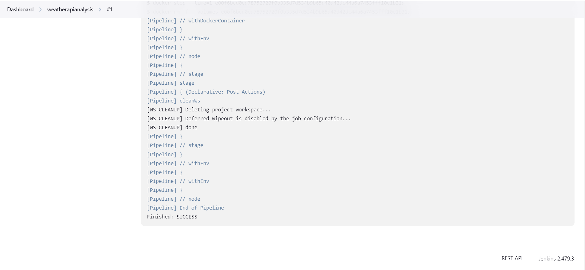

# Case Study - Weather Api Analysis Api

<p align="center">
    
</p>

### 📖 Information

<ul style="list-style-type:disc">
   <li> This project provides a **Spring Boot API** for **Air Quality Management**, allowing users to fetch **real-time and historical air quality data** based on request parameters. The API supports **logging** for request tracking and database integration. </li>
   <li>
      <b>Air Quality Management:</b> 
      <ul>
         <li> Retrieve **real-time air quality data** based on latitude, longitude, and date. </li>
         <li> Retrieve **historical air pollution data** based on **city name** and **date range**. </li>
         <li> <b>City Name is mandatory</b> in queries, while the **date range** is optional. If not provided, the system defaults to the **last 7 days**. </li>
         <li> Only **London, Barcelona, Ankara, Tokyo, and Mumbai** are supported for historical data queries. </li>
         <li> The API response includes **pollutant categories** (CO, SO2, O3, etc.), sorted **chronologically** in **JSON format**. </li>
         <li> <b>Example Request:</b> <code>/api/v1/airquality/history?city=ankara&startDate=16-01-2025&endDate=17-01-2025</code> </li>
         <li> <b>Example Response:</b> </li>
         <pre> { "City": "Ankara", "Results": [ { "Date": "16-05-2025", "Categories": [ { "CO": "Satisfactory" }, { "SO2": "Moderate" }, { "O3": "Satisfactory" } ] }, { "Date": "17-05-2025", "Categories": [ { "CO": "Good" }, { "SO2": "Severe" }, { "O3": "Satisfactory" } ] } ] } </pre>
      </ul>
   </li>
   <li>
      <b>Database Integration:</b> 
      <ul>
         <li> Each query first checks the **database**. Only missing data will be fetched from the **external API**, and then stored in the database. </li>
         <li> A log entry is created indicating whether data was retrieved from the **database** or from the **API**. </li>
         <li>
            <b>Example Workflow:</b> 
            <ul>
               <li><b>Query:</b> `Paris, 05-01-2025 to 10-01-2025` → Data is <b>not in the database</b>, so it is fetched from the **API** and stored.</li>
               <li><b>Query:</b> `Ankara, 05-01-2025 to 10-01-2025` → Data is <b>not in the database</b>, so it is fetched from the **API** and stored.</li>
               <li>
                  <b>Query:</b> `Paris, 01-01-2025 to 15-01-2025` → 
                  <ul>
                     <li>01-01-2025 to 04-01-2025 → **Fetched from API** and stored.</li>
                     <li>05-01-2025 to 10-01-2025 → **Fetched from the database**.</li>
                     <li>11-01-2025 to 15-01-2025 → **Fetched from API** and stored.</li>
                  </ul>
               </li>
            </ul>
         </li>
      </ul>
   </li>
   <li>
      <b>Logging:</b> 
      <ul>
         <li> <b>Custom Logging Aspect:</b> Logs details of REST controller method calls for database Integration and exceptions. </li>
      </ul>
   </li>
</ul>


### Explore Rest APIs

Endpoints Summary
<table style="width:100%;">
    <tr>
        <th>Method</th>
        <th>Url</th>
        <th>Description</th>
        <th>Request Body</th>
        <th>Path Variable</th>
        <th>Response</th>
    </tr>
    <tr>
        <td>POST</td>
        <td>/api/v1/airquality</td>
        <td>Retrieve air quality data</td>
        <td>AirQualityRequest</td>
        <td>None</td>
        <td>CustomResponse&lt;CustomAirQualityResponse&gt;</td>
    </tr>
</table>


### Technologies

---
- Java 21
- Spring Boot 3.0
- Restful API
- Mapstruct
- Open Api (Swagger)
- Maven
- Junit5
- Mockito
- Integration Tests
- Docker
- Docker Compose
- CI/CD (Github Actions - Jenkins)
- Postman
- TestContainer
- Postgres
- Prometheus
- Grafana
- Kubernetes
- JaCoCo (Test Report)
- Sonarqube

### Postman

```
Import postman collection under postman_collection folder
```


### Prerequisites

#### Define Variable in .env file

```
WEATHER_DB_IP=localhost
WEATHER_DB_PORT=5432
POSTGRES_USER=postgres
POSTGRES_PASSWORD=111111
OPEN_WEATHER_API_KEY={OPEN_WEATHER_API_KEY}
```

### Open Api (Swagger)

```
http://localhost:1100/swagger-ui/index.html
```

---

### JaCoCo (Test Report)

After the command named `mvn clean install` completes, the JaCoCo report will be available at:
```
target/site/jacoco/index.html
```
Navigate to the `target/site/jacoco/` directory.

Open the `index.html` file in your browser to view the detailed coverage report.

---

### Maven, Docker and Kubernetes Running Process


### Maven Run
To build and run the application with `Maven`, please follow the directions shown below;

```sh
$ cd weatherapianalyis
$ mvn clean install
$ mvn spring-boot:run
```

---

### Docker Run
The application can be built and run by the `Docker` engine. The `Dockerfile` has multistage build, so you do not need to build and run separately.

Please follow directions shown below in order to build and run the application with Docker Compose file;

```sh
$ cd weatherapianalyis
$ docker-compose up -d
```

If you change anything in the project and run it on Docker, you can also use this command shown below

```sh
$ cd weatherapianalyis
$ docker-compose up --build
```

To monitor the application, you can use the following tools:

- **Prometheus**:  
  Open in your browser at [http://localhost:9090](http://localhost:9090)  
  Prometheus collects and stores application metrics.

- **Grafana**:  
  Open in your browser at [http://localhost:3000](http://localhost:3000)  
  Grafana provides a dashboard for visualizing the metrics.  
  **Default credentials**:
    - Username: `admin`
    - Password: `admin`

- Define prometheus data source url, use this link shown below

```
http://prometheus:9090
```

---


### Kubernetes Run
To build and run the application with `Maven`, please follow the directions shown below;

- Start Minikube

```sh
$ minikube start
```

- Open Minikube Dashboard

```sh
$ minikube dashboard
```

- To deploy the application on Kubernetes, apply the Kubernetes configuration file underneath k8s folder

```sh
$ kubectl apply -f k8s
```

- To open Prometheus, click tunnel url link provided by the command shown below to reach out Prometheus

```sh
minikube service prometheus-service
```


- To open Grafana, click tunnel url link provided by the command shown below to reach out Prometheus

```sh
minikube service grafana-service
```

- Define prometheus data source url, use this link shown below

```
http://prometheus-service.default.svc.cluster.local:9090
```

- To open Sonarqube, click tunnel url link provided by the command shown below to reach out Sonarqube

```sh
minikube service sonarqube
```


---
### Docker Image Location

```
https://hub.docker.com/repository/docker/noyandocker/jenkins-jenkins/general
https://hub.docker.com/repository/docker/noyandocker/weatherapianalysis/general
```

### Sonarqube

- Go to `localhost:9000` for Docker and Go there through `minikube service sonarqube` for Kubernetes
- Enter username and password as `admin`
- Change password
- Click `Create Local Project`
- Choose the baseline for this code for the project as `Use the global setting`
- Click `Locally` in Analyze Method
- Define Token
- Click `Continue`
- Copy `sonar.host.url` and `sonar.token` (`sonar.login`) in the `properties` part in  `pom.xml`
- Run `mvn sonar:sonar` to show code analysis

### Jenkins

- Go to `jenkins` folder
- Run `docker-compose up -d`
- Open Jenkins in the browser via `localhost:8080`
- Go to pipeline named `weatherapianalysis`
- Run Pipeline
- Show `Pipeline Step` to verify if it succeeded or failed


### Screenshots

<details>
<summary>Click here to show the screenshots of project</summary>
    <p> Figure 1 </p>
    
    <p> Figure 2 </p>
    
    <p> Figure 3 </p>
    
    <p> Figure 4 </p>
    
    <p> Figure 5 </p>
    
    <p> Figure 6 </p>
    
    <p> Figure 7 </p>
    
    <p> Figure 8 </p>
    
    <p> Figure 9 </p>
    
    <p> Figure 10 </p>
    
    <p> Figure 11 </p>
    
    <p> Figure 12 </p>
    
    <p> Figure 13 </p>
    
    <p> Figure 14 </p>
    
    <p> Figure 15 </p>
    
    <p> Figure 16 </p>
    
    <p> Figure 17 </p>
    
    <p> Figure 18 </p>
    
    <p> Figure 19 </p>
    
    <p> Figure 20 </p>
    
    <p> Figure 21 </p>
    
    <p> Figure 22 </p>
    
    <p> Figure 23 </p>
    
    <p> Figure 24 </p>
    
    <p> Figure 25 </p>
    
    <p> Figure 26 </p>
    
    <p> Figure 27 </p>
    
    <p> Figure 28 </p>
    
    <p> Figure 29 </p>
    
    <p> Figure 30 </p>
    
    <p> Figure 31 </p>
    
    <p> Figure 32 </p>
    
    <p> Figure 33 </p>
    
    <p> Figure 34 </p>
    
    <p> Figure 35 </p>
    
</details>


### Contributors

- [Sercan Noyan Germiyanoğlu](https://github.com/Rapter1990)